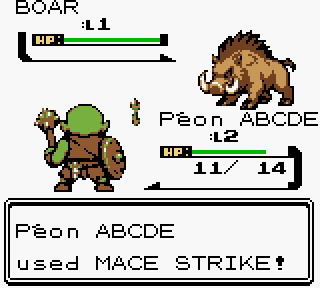

# Peon of Warcraft — playable v0.2.3

[Download playable ROM](https://raw.githubusercontent.com/GASPARDWALT/peon-of-warcraft/refs/heads/main/releases/v0.2.3/peon_of_warcraft_v0_2_3.zip) · [Download assets + offline browser gallery](https://raw.githubusercontent.com/GASPARDWALT/peon-of-warcraft/refs/heads/main/releases/v0.2.3/peon_of_warcraft_v0_2_3_assets.zip) · [Download transparent PNGs](https://raw.githubusercontent.com/GASPARDWALT/peon-of-warcraft/refs/heads/main/releases/v0.2.3/peon_of_warcraft_v0_2_3_transparent_png.zip) · [Walkthrough and limits](docs/V0_2_3_PLAYABLE.md)

The apprentice now braces to cast and swings his mace using three authored native combat poses. All eleven playable enemy types also have three distinct poses. Combat attrition is slightly harder: two equal-level foes are manageable, while a third often needs a potion or better spell choices. [Measured balance and test limits](docs/V023_COMBAT_BALANCE.md) cover 99 native diagnostic chains; normal-button progression and four prior-version battery saves are tested separately.

The Durotar chapter has eighteen settlement NPCs, six residences and three inns, fourteen speaker portraits, eight additional enemies, rocky roads, Horde banners and palisades. Accepted/ready quests change their markers; turn-ins award XP, harvested cacti disappear, and defeated enemies stay gone after battery saves. Kento asks your peon's name and sells eleven level-gated Shaman lessons, including level-four Flame Shock and level-six Healing Wave. Eleven original elemental animations, a reusable battle Earth Totem, turn-consuming potions/water and seven native music themes are integrated. The level-four scorpid pack is two successive one-on-one battles. One real save slot and four attacks remain; other classes and six stored attacks are future systems. Actual Chromatic cartridge/RTC validation remains outstanding.

[Design rules and Warcraft vocabulary](docs/PEON_DESIGN_RULES.md) · [Village NPC sources/services](docs/DUROTAR_VILLAGE_NPCS.md) · [Previous v0.2.2 release](releases/v0.2.2/README.md)

## Original Pokémon Crystal documentation [![Build Status][ci-badge]][ci]

This is a disassembly of Pokémon Crystal.

It builds the following ROMs:

- Pokemon - Crystal Version (UE) (V1.0) [C][!].gbc `sha1: f4cd194bdee0d04ca4eac29e09b8e4e9d818c133`
- Pokemon - Crystal Version (UE) (V1.1) [C][!].gbc `sha1: f2f52230b536214ef7c9924f483392993e226cfb`
- Pokemon - Crystal Version (A) [C][!].gbc `sha1: a0fc810f1d4e124434f7be2c989ab5b5892ddf36`
- CRYSTAL_ps3_010328d.bin `sha1: c60d57a24bbe8ecf7cba54ab3f90669f97bd330d`
- CRYSTAL_ps3_us_revise_010710d.bin `sha1: 391ae86b1d5a26db712ffe6c28bbf2a1f804c3c4`
- CGBBYTE1.784.patch `sha1: a25517f60ca0e887d39ec698aa56a0040532a4b3`

To set up the repository, see [INSTALL.md](INSTALL.md).

## See also

- [**FAQ**](FAQ.md)
- [**Documentation**][docs]
- [**Wiki**][wiki] (includes [tutorials][tutorials])
- [**Symbols**][symbols]
- [**Tools**][tools]

You can find us on [Discord (pret, #pokecrystal)](https://discord.gg/d5dubZ3).

For other pret projects, see [pret.github.io](https://pret.github.io/).

[docs]: https://pret.github.io/pokecrystal/
[wiki]: https://github.com/pret/pokecrystal/wiki
[tutorials]: https://github.com/pret/pokecrystal/wiki/Tutorials
[symbols]: https://github.com/pret/pokecrystal/tree/symbols
[tools]: https://github.com/pret/gb-asm-tools
[ci]: https://github.com/pret/pokecrystal/actions
[ci-badge]: https://github.com/pret/pokecrystal/actions/workflows/main.yml/badge.svg
