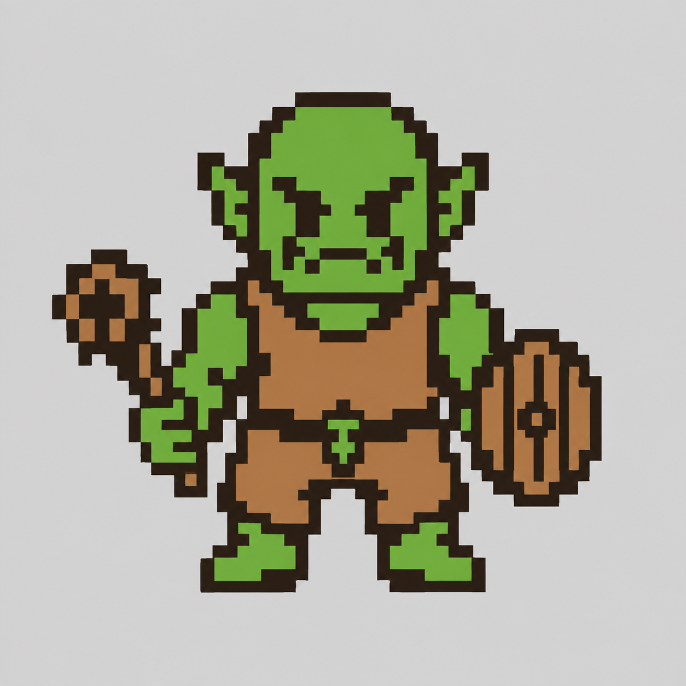
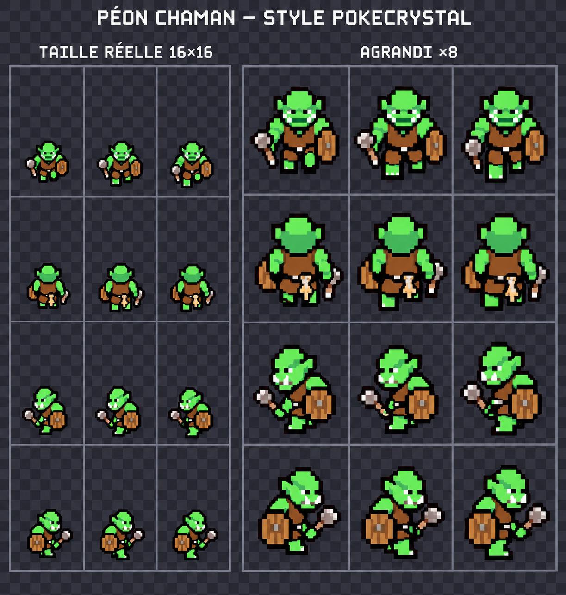
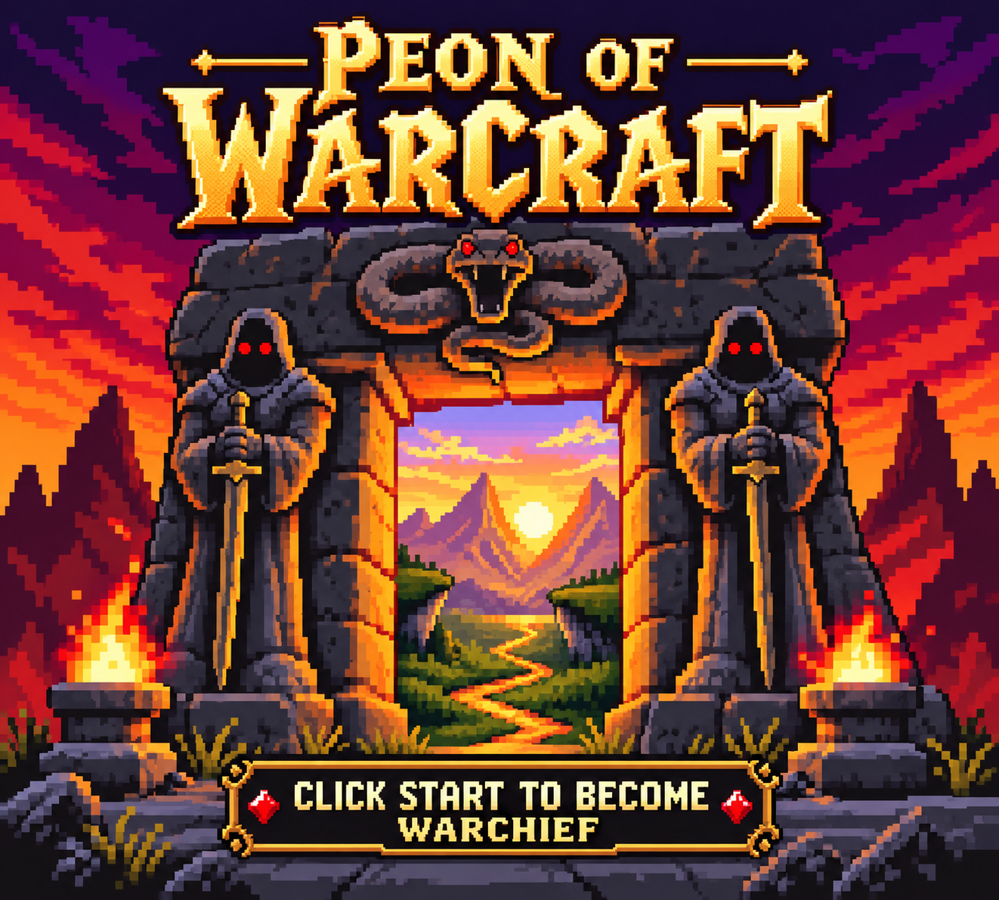
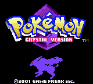
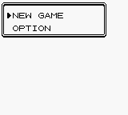

# Visuels générés — Peon of Warcraft

## Nouveau : peon réellement intégré

[Ouvrir les captures, la planche technique et l'animation du peon dans le jeu](peon_in_game/README.md).

Le joueur à pied est maintenant remplacé dans la ROM. Les images ci-dessous restent les anciennes maquettes de direction artistique ; la capture de Crystal plus bas décrit l'état avant cette intégration.

Cliquez sur les noms pour ouvrir les images dans GitHub. Les propositions sont des maquettes visuelles, pas des sprites ou écrans déjà intégrés dans la ROM.

## Peon chaman

### Proposition de face

### Planche directionnelle — dernière proposition

[Première version de la planche](peon_shaman_overworld_sheet_v1.png)

Les mentions « 16 × 16 » et « ×8 » font partie de la présentation générée : les images ne sont pas des exports techniques validés. La palette, la grille et les animations doivent encore être adaptées à pokecrystal.

## Écran titre

[Vidéo de 16 secondes avec la musique de référence](title_screen_mockup_with_music.mp4)

Si GitHub ne lit pas la vidéo directement, ouvrez son fichier puis utilisez le bouton de téléchargement du fichier brut.

## Captures de la base avant intégration du peon

Ces captures historiques viennent de Pokémon Crystal d'origine, avant le remplacement du joueur. Pour l'état actuel, consulter la galerie `peon_in_game` en haut de cette page. Matériel Chromatic non testé.

[Capture de la transition d'introduction](pokecrystal_intro_capture.png)

## Convention

Enregistrer les futurs visuels générés dans `references/generated/`, avec des noms explicites. Conserver les références fournies par l'utilisateur dans les autres sous-dossiers de `references/`.
# First playable v0.1

[Open the actual ROM gallery](v0_1_playable/README.md) · [Download playable ZIP](https://github.com/GASPARDWALT/peon-of-warcraft/raw/refs/heads/main/releases/v0.1/peon_of_warcraft_v0_1.zip) · [Walkthrough and limits](../../docs/V0_1_PLAYABLE.md)
