# Durotar v0.2 — real ROM captures and transparent assets

[Download playable ROM](../../../releases/v0.2/peon_of_warcraft_v0_2.zip) · [Download PNGs, animations and browser gallery](../../../releases/v0.2/peon_of_warcraft_v0_2_assets.zip) · [Walkthrough / limitations](../../../docs/V0_2_PLAYABLE.md)

These captures come from the actual GBC ROM. The larger concept images are references, not game screenshots. All sprite PNGs are transparent; maps/backgrounds are opaque.

### 01 title

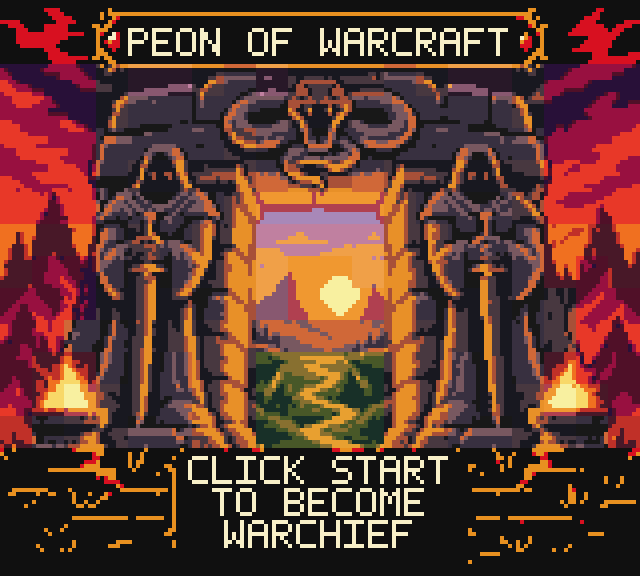

### 07b master naming

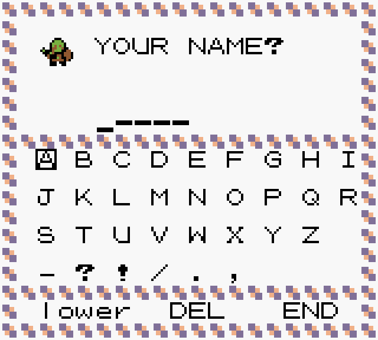

### 08 the den

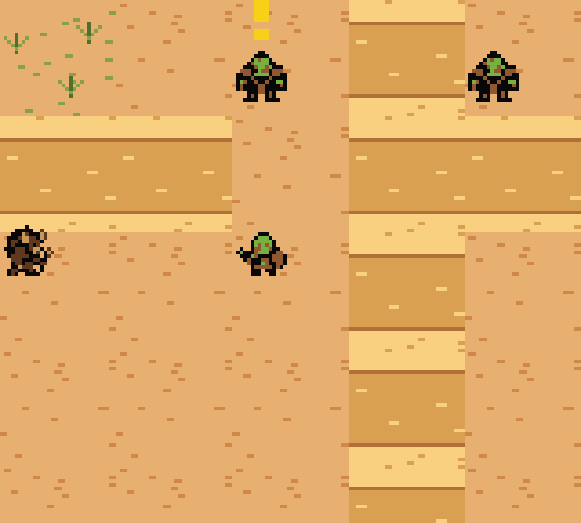

### 20 zone map den

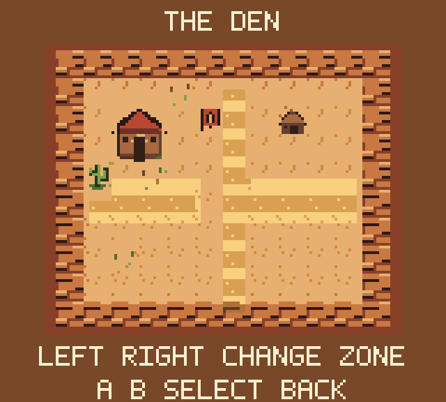

### 21 zone map fog

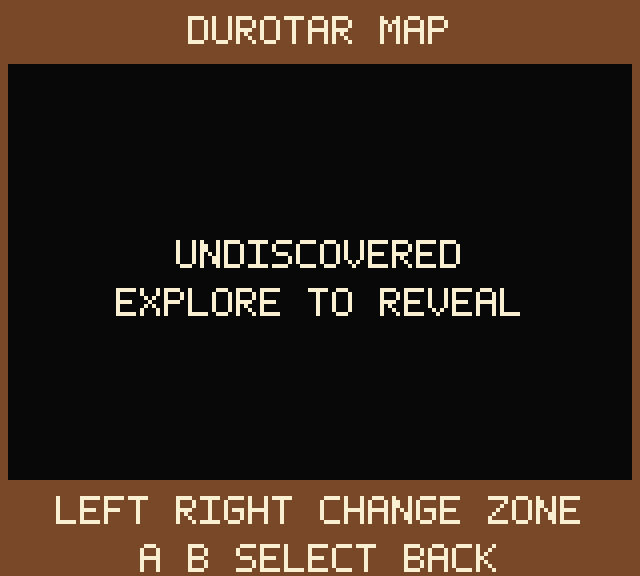

### 22 shaman sheet

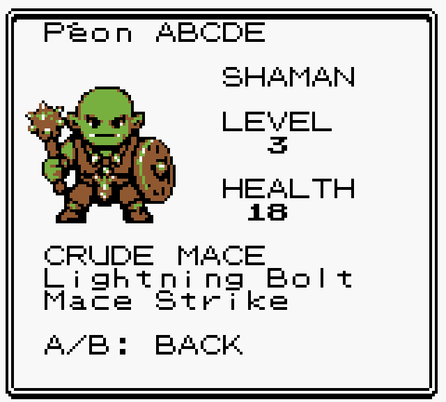

### 23 bags

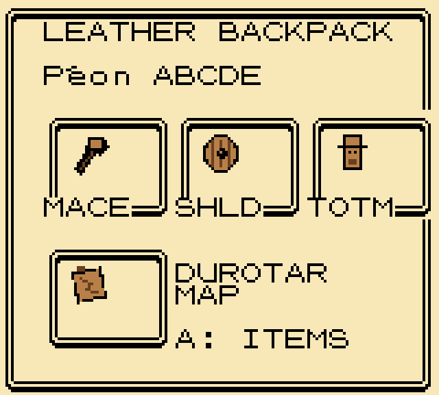

### 23b inventory

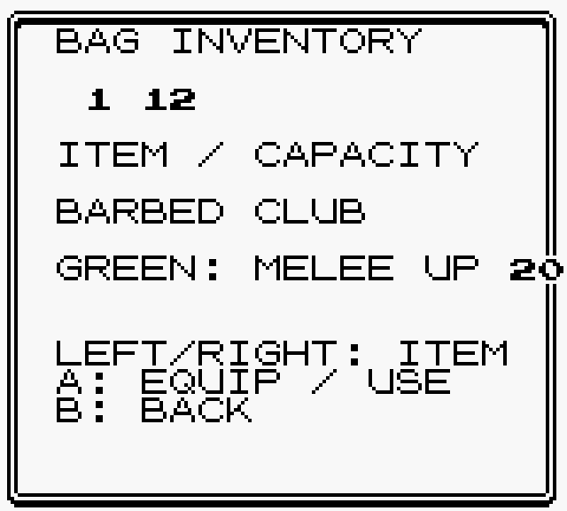

### 24c red imp battle

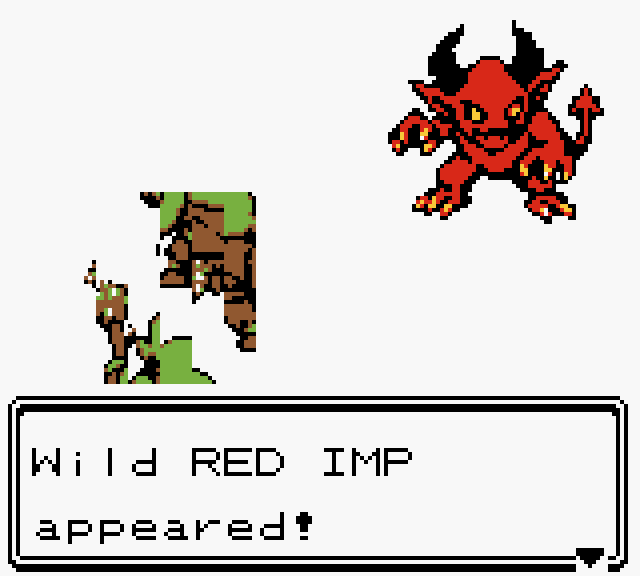

### 25 orgrimmar map

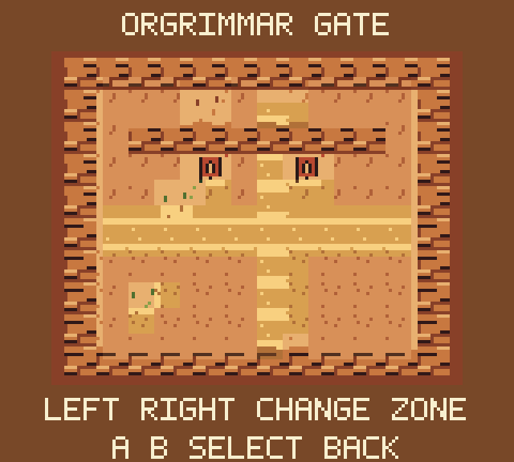

### Animations

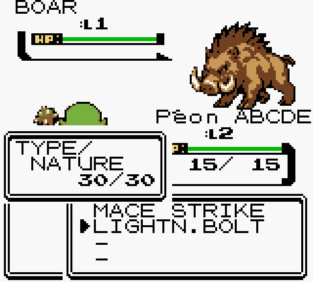

### Overworld

**boar** — 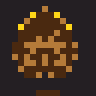

**gornek** — 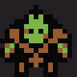

**hunter** — 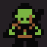

**imp** — 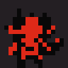

**kento** — 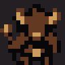

**peon** — 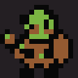

**scorpid** — 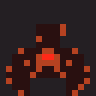

**thrall** — 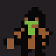

**warlock** — 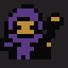

**warrior** — 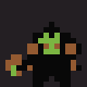

### Battle

**boar** — 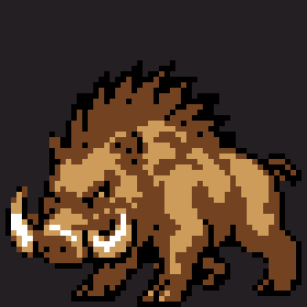

**imp** — 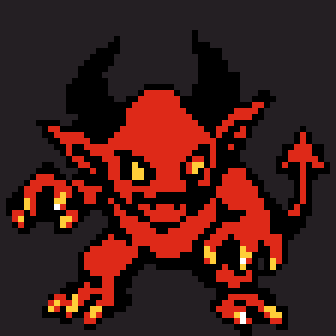

**kento** — 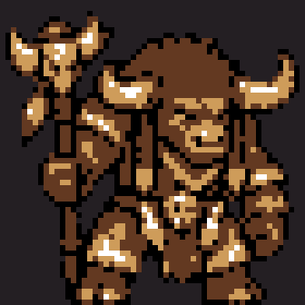

**peon** — 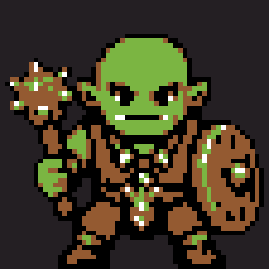

**scorpid** — 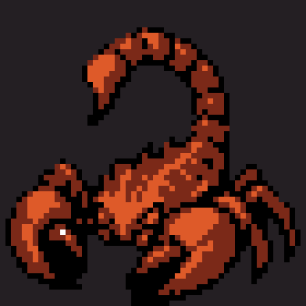

**thrall** — 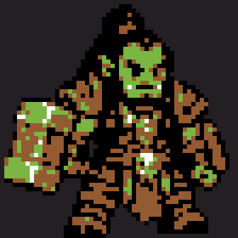

**warlock** — 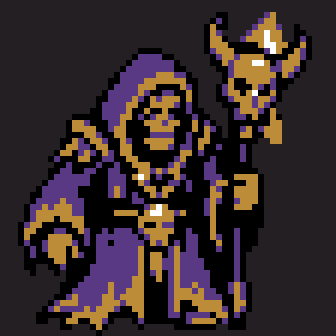

**warrior** — 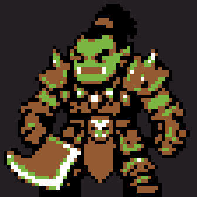

### Source concept art

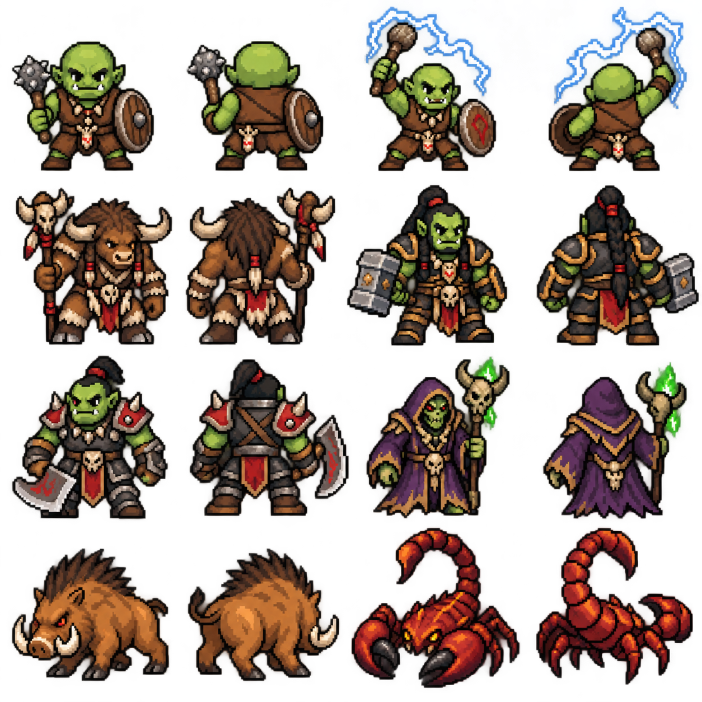

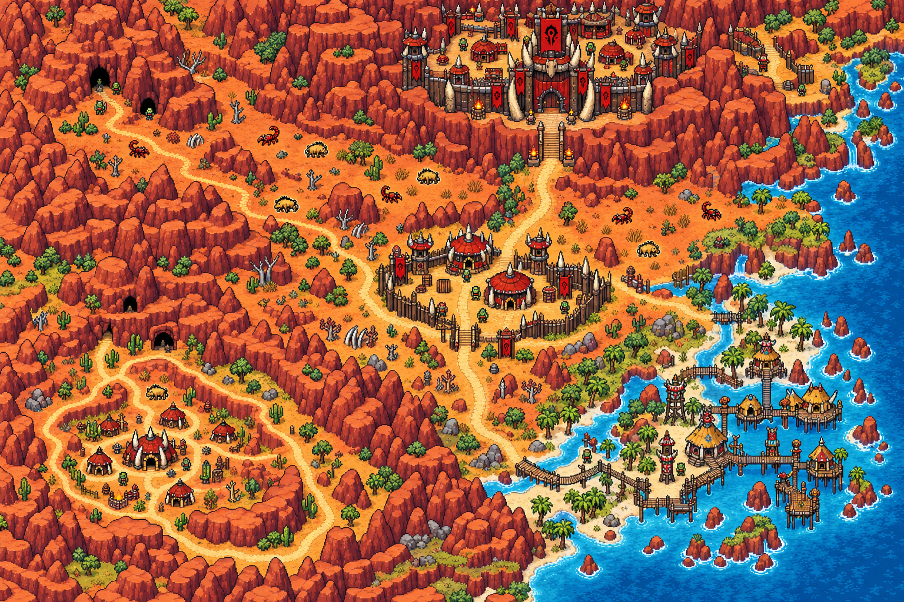
