# Peon of Warcraft — Durotar v0.2.1 asset gallery

**Offline browser:** download the asset archive, extract it and open `durotar_v021/index.html`. Keep `durotar_v02` and `title_portal_gbc` beside `durotar_v021`; the gallery also includes the base characters, equipment, spell captures and title art from those folders.

The browser currently lists **1266 PNG/GIF files**, including **824 files from this pass**. Search and filter by group, character, file type, transparency and animation. Every image has a direct native-file and download link.

The labels distinguish actual ROM captures, native assets, prepared NPC presentation animations, source concepts and technical engine inputs. A larger concept is not a game screenshot. Friendly village battle poses are prepared animations; this asset pass does not add fights against vendors or questgivers.

All public sprite/portrait PNGs have transparency. Maps and screenshots retain their backgrounds. Palette-indexed engine sheets and alpha masks are data inputs; the gallery marks them separately.

### Offline browser gallery

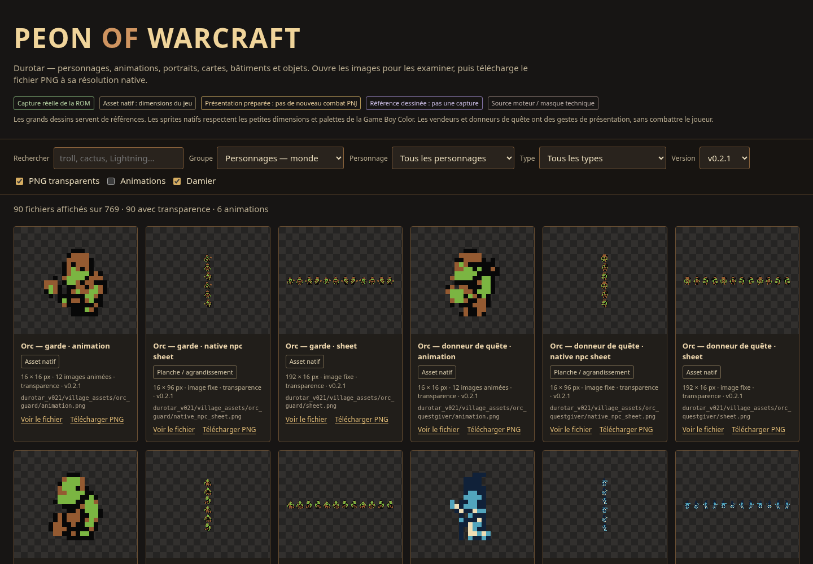

### Village NPCs — native 16×16

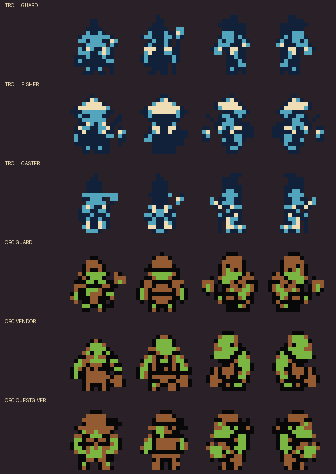

### Six village roles — larger poses and 24×24 portraits

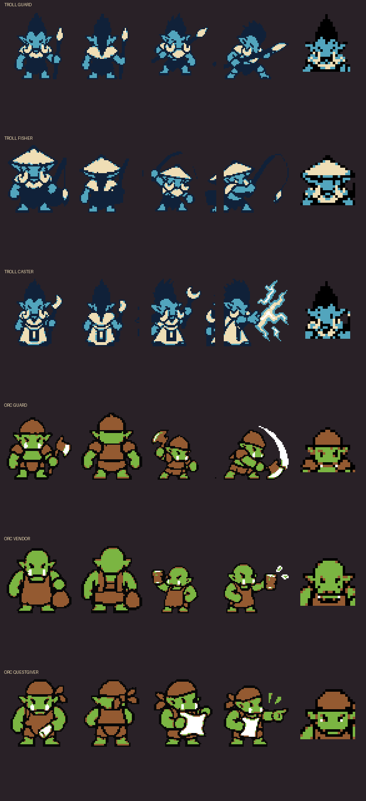

### Speaker portraits

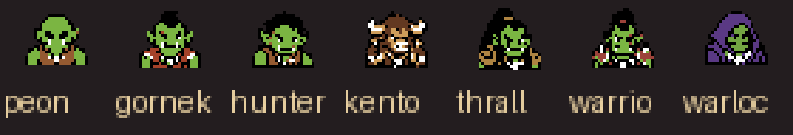

### Direct peon encounter — actual ROM

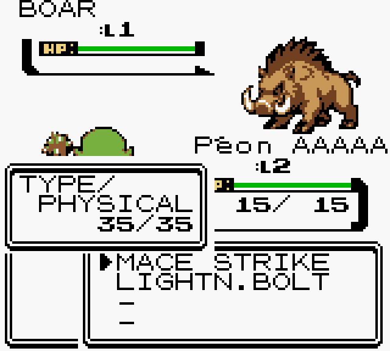

### The Den campfire — actual ROM

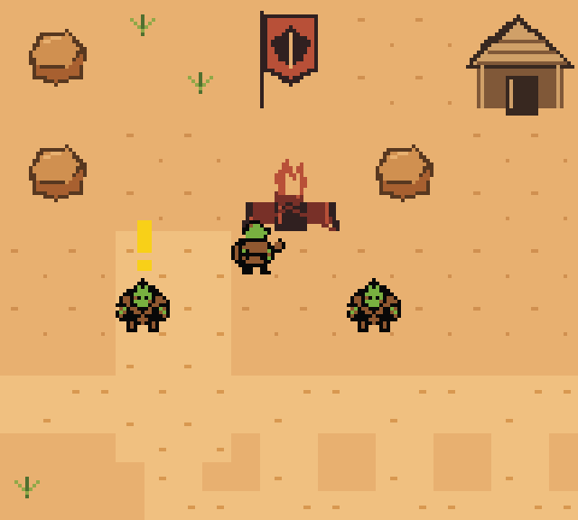

### Warcraft backpack — actual ROM

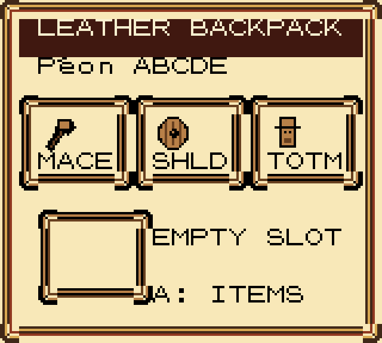

### Weapon quality — actual ROM

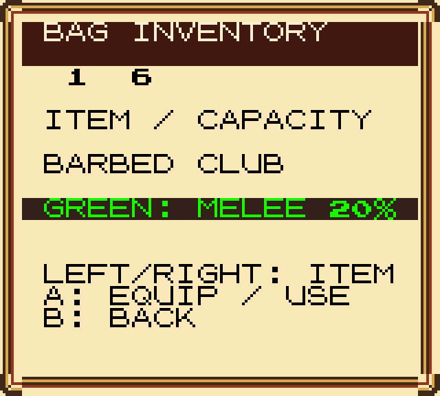

### Boar and scorpid attacks

### The Den

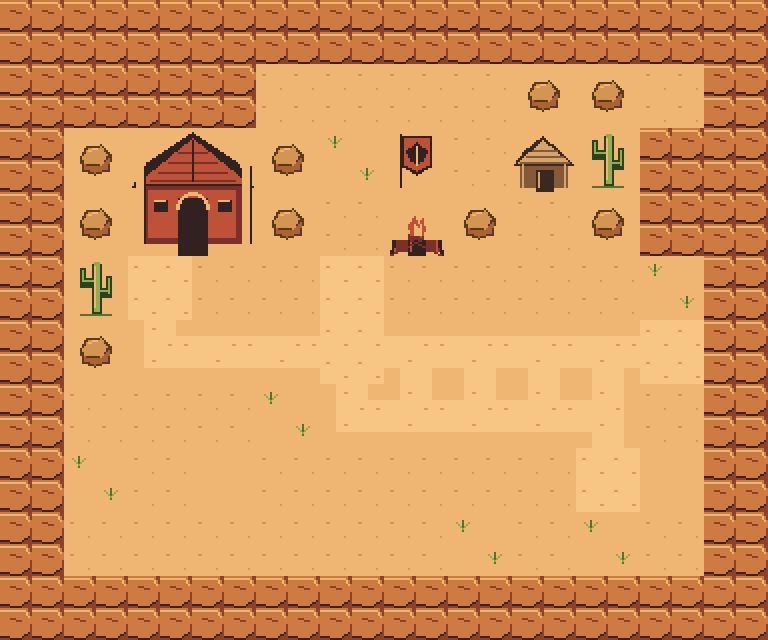

### Sen’jin Village

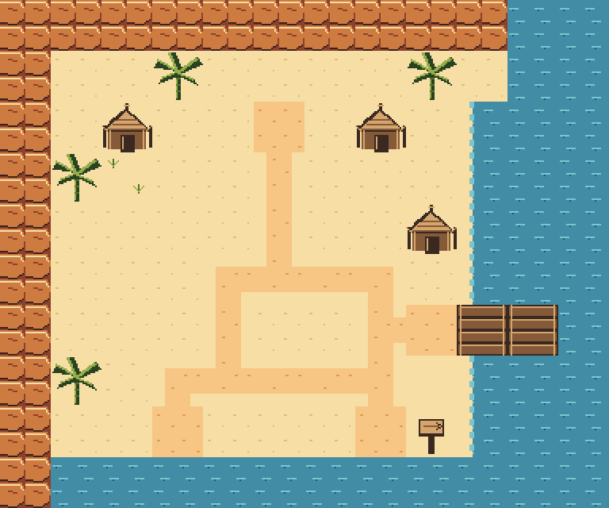

### Razor Hill

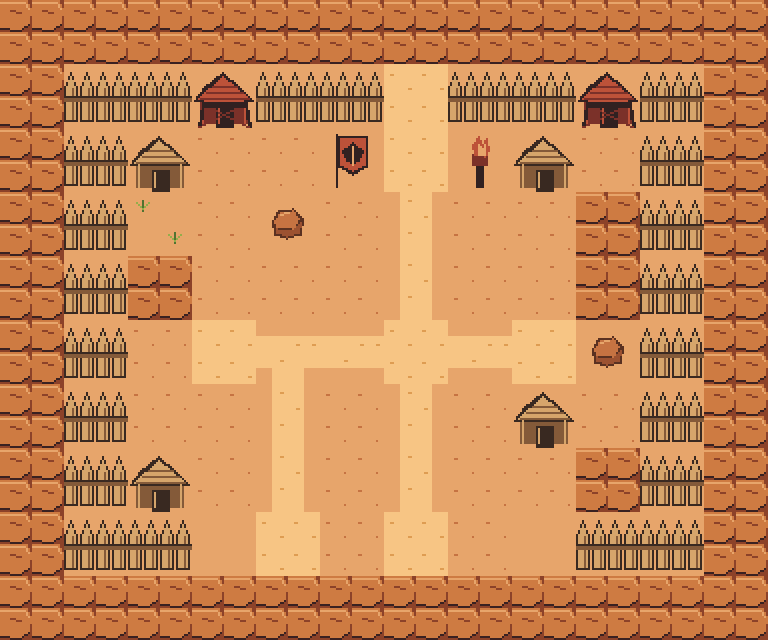

### Actual ROM captures from this pass

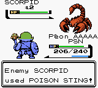

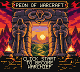

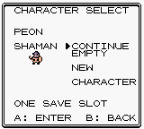

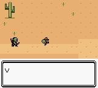

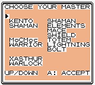

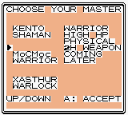

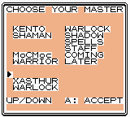

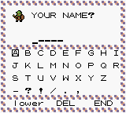

### Folder guides

- [Native village NPCs](village_assets/README.md)
- [Larger village poses and portraits](village_battles/README.md)
- [Speaker portraits](speaker_portraits/README.md)
- [Base v0.2 characters, spells and objects](../durotar_v02/README.md)
- [Portal title art](../title_portal_gbc/README.md)
- [Native title audio — actual emulator WAV](title_music/peon_title_native_16s.wav)
- [Warcraft-inspired sound effects — listen offline](sound_effects/index.html)

Regenerate after new assets or emulator captures: `python3 tools/build_peon_v021_gallery.py`. No web server, network connection or external dependencies are used by the HTML gallery.
