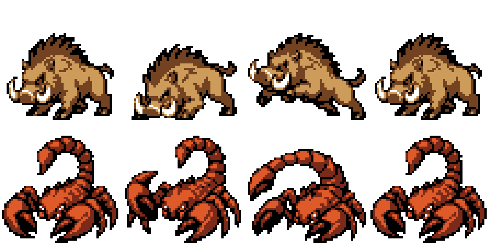

# Durotar enemy attacks

These are native sprites used by the ROM, with four opaque colors and binary
transparency. The large source atlas is kept separately; it is reduced to the
56×56 pixel battle grid before palette conversion.

| Enemy | Transparent animation | Sprite sheet | Back silhouette |
| --- | --- | --- | --- |
| Mottled boar | [APNG](boar/animation.png) · [GIF](boar/preview.gif) | [PNG](boar/sheet.png) | [48×48 PNG](boar/back.png) |
| Red scorpid | [APNG](scorpid/animation.png) · [GIF](scorpid/preview.gif) | [PNG](scorpid/sheet.png) | [48×48 PNG](scorpid/back.png) |

Each four-frame loop is idle → anticipation → strike → recovery. The boar
crouches before lunging; the scorpid raises its claw, then swings its tail.
These change the silhouette rather than translating the entire sprite.

Actual ROM captures: [boar attack](in_game/boar_actual_attack.gif),
[scorpid sting](in_game/scorpid_actual_attack.gif), and
[imp casting](in_game/imp_actual_attack.gif). The imp uses its existing native
firecasting poses; the two beast sheets above replace their former bobbing frames.

The [ordinary encounter from the world](in_game/peon_native_encounter_from_world.gif)
now fades straight to the peon facing his enemy. No trainer picture, trainer
slide, ball, summon message, or old creature cry appears during that introduction.
Kento asks for the player's name once; the internal character adapter no longer
opens a second creature nickname prompt.

In the ROM, `PeonAnimateEnemyAttack` plays the front poses before the normal
move effect. Battle-scene OFF skips them; substitute and minimized enemies
are left to Crystal's existing rendering. The existing impact and damage
animations continue afterward.

Crystal normally uploads 98 animation tiles. These complete silhouettes need
109 for the boar and 120 for the scorpid, so a small guarded loader uploads
the extra 11/22 tiles into VRAM bank 1 on picture load and before attacks.
Both remain within the 128-tile budget. The emulator check compares every
pixel of all 12 native front poses with the compiled sprites in RGB555;
checking frame numbers alone would miss incomplete tile uploads.

Crystal's poison code is unchanged: Poison Sting can apply the status,
the original poison animation plays, and ordinary poison removes one eighth
of maximum HP each residual-damage tick. The Den's training encounter heals
the player after combat, including poison. The separate diagnostic test
documents any temporary emulator RAM changes; those changes are never written
into the game or a user's save.

[Emulator report](in_game/validation.json) also verifies that substitute,
minimized, and battle-scene OFF guards skip the pose animation. These checks
use isolated, rewound diagnostic fights and restore the injected flags before
the normal move effect executes.

Regenerate with `python tools/build_peon_beast_attacks.py` after the base asset
compiler. Run the built-ROM check with
`PYTHONPATH=/workspace/toolchains/pyboy-preview python tools/build_peon_beast_attacks.py --validate`.
