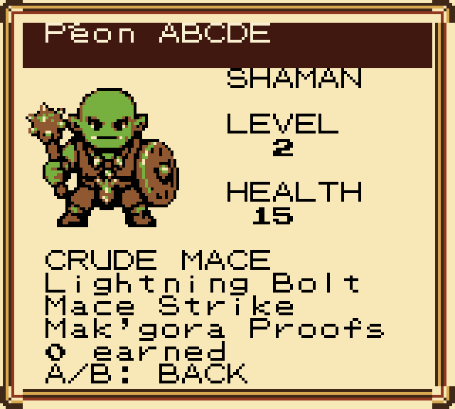
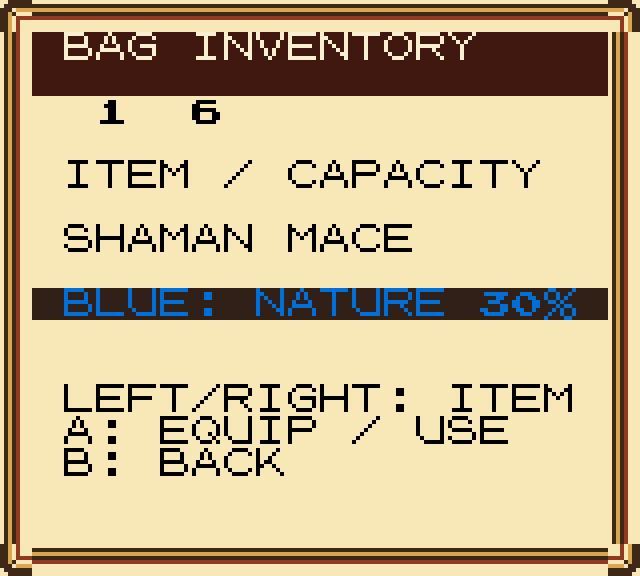
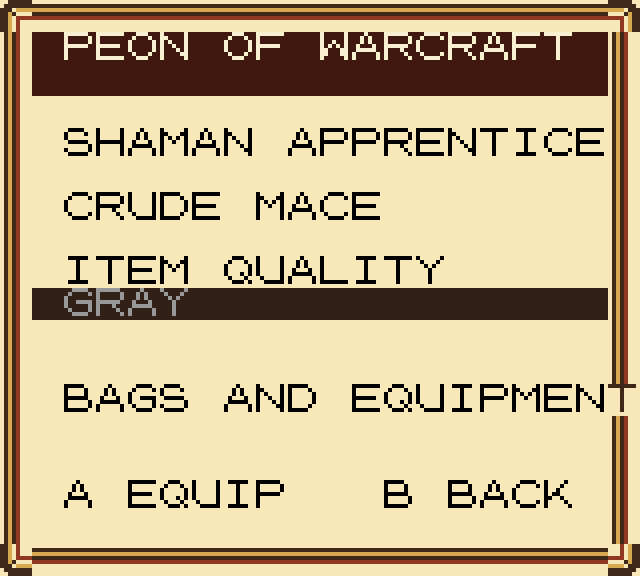

# Warcraft menu skin

The fullscreen character and inventory menus use a parchment body, Horde-red
header and raised gold/leather frame. Equipment quality uses Classic-inspired
gray, white, green and blue text on a dark leather ribbon.

The character sheet and backpack above use normal new-game play. The blue-item
capture is a controlled rendering check with one item inserted into a temporary
emulator inventory. It does not claim a blue item drops automatically on a new
character. [Validation report](validation.json).

These images demonstrate the **native 160×144 style**. The ROM retains its
existing screen layouts and labels; in-game captures are exported separately.

Transparent eight-pixel frame pieces:

- `frame_top_left.png`, `frame_top_right.png`
- `frame_bottom_left.png`, `frame_bottom_right.png`
- `frame_horizontal.png`, `frame_vertical.png`
- `frame_tiles_transparent.png` — six-tile sheet.
- `percent_glyph.png` — native 8×8 percentage glyph.

The skin uses four CGB background palettes and only **seven tile graphics**:
six replace the existing textbox glyphs, and one supplies the percentage symbol
while these menus are open.
The original font graphics return when the game closes the menu.

Regenerate with `python tools/build_peon_menu_skin.py`.
