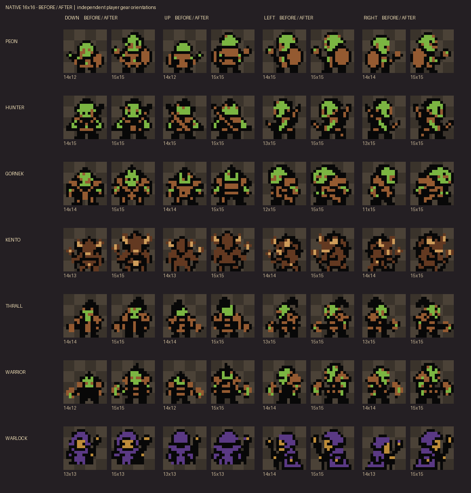
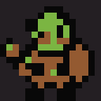
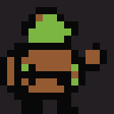
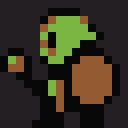
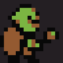

# Native humanoid size and walking polish

The existing 16×16 sprite footprint is unchanged. The peon and six original humanoid roles use more of that space, with a target of 15×15 at rest and a one-pixel upper-body walking bob. Every exact opaque bounding box is recorded in `bounding_boxes.json`; irregular silhouettes can occupy less than the target.



The player retains twelve independent source frames and separately drawn left/right equipment. NPCs retain the standard six-frame format and Crystal’s existing reflection of right-facing and alternate front/back walking poses. No new OAM size, palette, save field or collision was added.

**Actual four-phase player source loops:** idle → step A → idle → step B.

**down** — 

**up** — 

**left** — 

**right** — 

Each humanoid folder in `durotar_v02/overworld/` also contains `walk_down.png`, `walk_up.png`, `walk_left.png`, `walk_right.png` (transparent APNG) and their GIF previews.

Regenerate only these assets with:

```python
import runpy
a = runpy.run_path("tools/build_durotar_assets.py")
a["characters"](only=a["NAMES"][:7], auxiliary=False)
```
