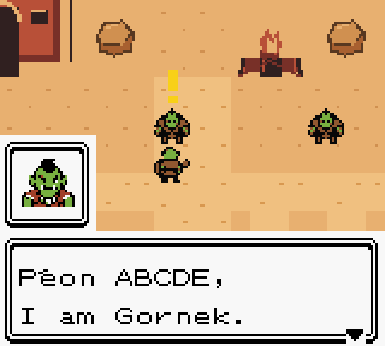

# Native speaker portraits


The seven original speakers now have transparent **24 × 24 PNG** portraits:

- [Orc Peon](peon.png)
- [Gornek](gornek.png)
- [Hunter](hunter.png)
- [Kento Brandenhoof](kento.png)
- [Thrall](thrall.png)
- [MoCMoc Zogzog](warrior.png)
- [Xasthur](warlock.png)

Each portrait uses nine Game Boy tiles and four opaque colours, with transparent
backgrounds in these exports. Files ending `_8x.png` are enlarged with nearest
neighbour rendering for easy viewing.

The ROM shows the portrait in a small frame above the dialogue window. The
existing 18-character text width is preserved. Sen'jin and settlement portraits
are in [the village battle gallery](../village_battles/).



The emulator validation starts a new character with ordinary buttons and talks
to Gornek. It verifies the exact native portrait colours, reserved VRAM tiles,
unchanged terrain/NPC graphics, and font/palette restoration when dialogue closes.
Thirteen additional portrait variants use the same conversation with controlled
speaker metadata substitution; those captures verify rendering, rather than
thirteen separate story encounters. See [the validation report](emulator_validation.json).

Regenerate these seven assets with `python tools/build_peon_speaker_portraits.py`.
The village portrait generator owns its separate six files.

Run the dedicated emulator check with:

```sh
PYTHONPATH=/workspace/toolchains/pyboy-preview python tools/validate_peon_speaker_portraits.py
```
