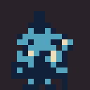
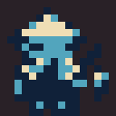
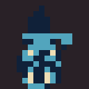
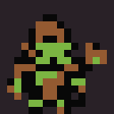
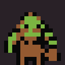
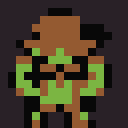

# Native Warcraft village NPCs

These 16×16 sprites are the native game assets, enlarged without smoothing below. The larger concept is a source reference. NPCs use three opaque colors plus transparency; right-facing sprites use Crystal’s normal reflection.

**troll guard** — 

**troll fisher** — 

**troll caster** — 

**orc guard** — 

**orc vendor** — 

**orc questgiver** — 

Each character folder contains twelve transparent frame PNGs, a transparent `sheet.png`, `animation.png` (APNG), and the exact six-frame `native_npc_sheet.png` used by the engine. These six NPC roles are a starting population, not a complete reproduction of Classic’s NPC roster.

Regenerate with `python3 tools/build_durotar_village_assets.py`.
