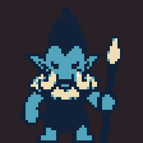
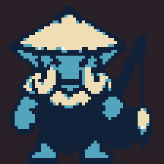
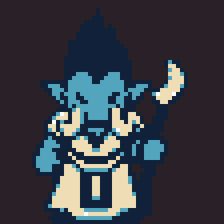
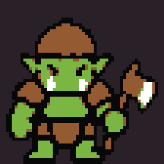
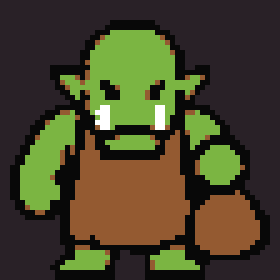
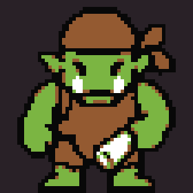

# Village battle silhouettes and speaker portraits

Six distinct roles with native 56×56 front/action sprites, 48×48 backs, and 24×24 dialogue portraits. Public sprite and portrait PNGs are transparent. White highlights inside a sprite remain opaque through explicit alpha masks. The reference atlas is larger than the actual ROM graphics.

**troll guard** — 

**troll fisher** — 

**troll caster** — 

**orc guard** — 

**orc vendor** — 

**orc questgiver** — 

These are prepared assets: vendor and questgiver animations are friendly gestures. This asset pass adds no new NPC fights. Speaker portraits are supplied separately to the ROM dialogue renderer.

Regenerate with `python3 tools/build_durotar_village_battles.py`.
