# Durotar v0.2.2 native enemy roster

The transparent native exports below are the reduced game pixels. Large original concept atlases are retained separately as source art. MACHOP66 remains the player; eight previously unused species slots adapt these Durotar enemies without changing the save layout.

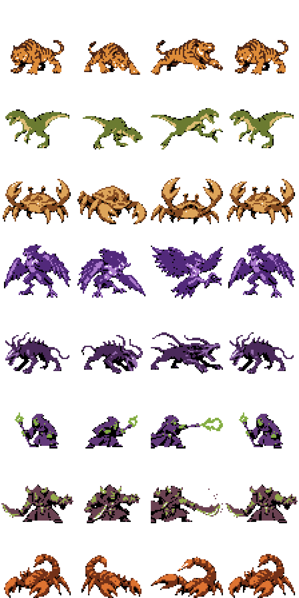

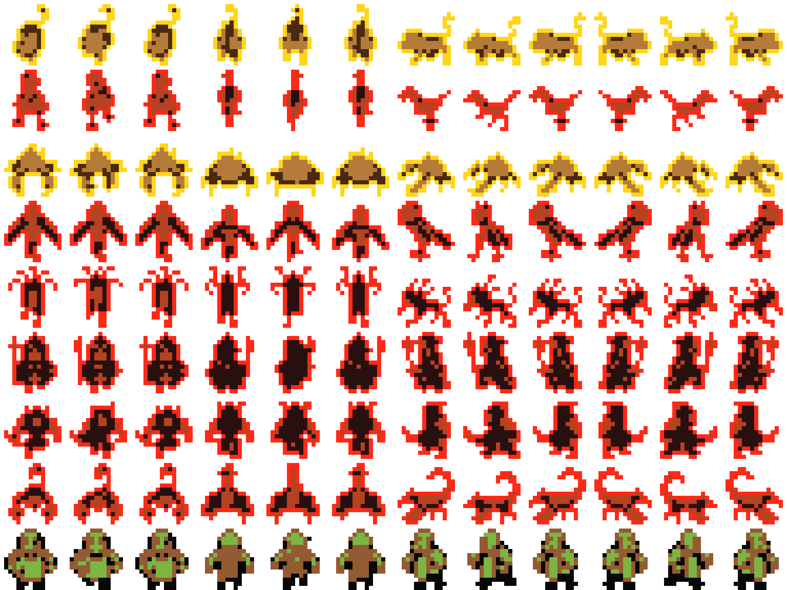

Each enemy folder contains twelve transparent16×16 walking PNGs, the six-frame native NPC sheet, four56×56 battle pose PNGs, a48×48 back, transparent APNG loops and GIF previews. Right-facing NPCs use Crystal reflection, and the third public walking phase returns to idle. Four battle phases are idle → prepare → attack → return; the anticipation and strike are independently redrawn anatomy. The enemy helper preserves original impact effects and poison mechanics.

**TIGER** — 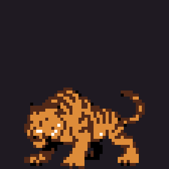

**RAPTOR** — 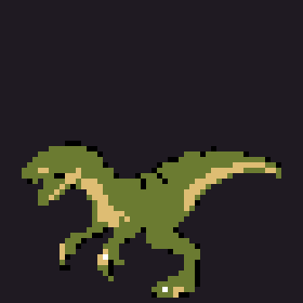

**CRAWLER** — 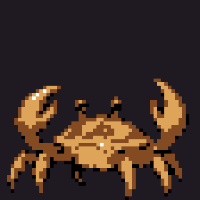

**HARPY** — 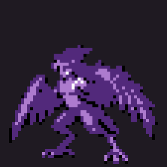

**FELSTALKER** — 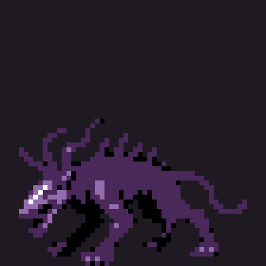

**CULTIST** — 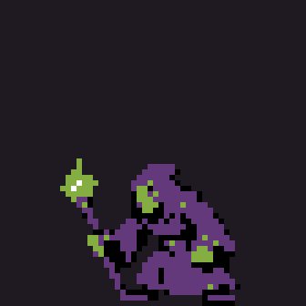

**YARROG** — 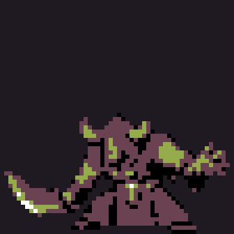

**SARKOTH** — 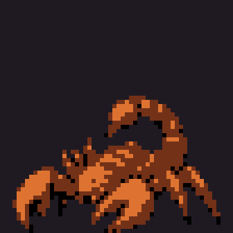

**Innkeeper portrait** — 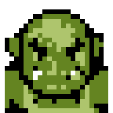

**Additional decor proposals** — transparent native-size PNGs, awaiting world-tile integration; the eight enemy assets above are integrated.

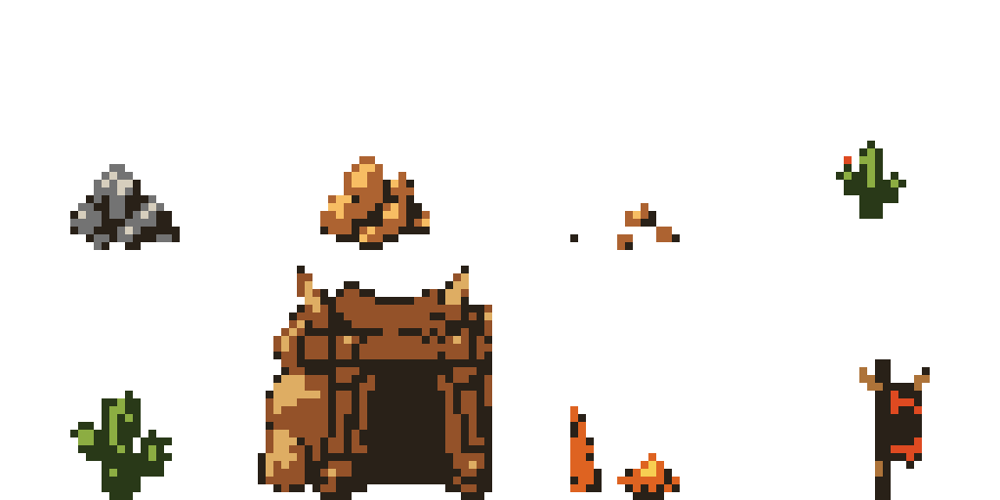

Regenerate with `python tools/build_peon_enemy_roster.py`. After building the ROM, validate with `PYTHONPATH=/workspace/toolchains/pyboy-preview python tools/build_peon_enemy_roster.py --validate`. The validator copies the ROM to a temporary directory and never opens the user save. Its eight battle diagnostics substitute only temporary encounter RAM and raise HP to observe complete poses. `compiled_validation.json` records the tested ROM hash and32pixel-exact RGB555 pose checks. Ordinary map encounters are checked separately.
