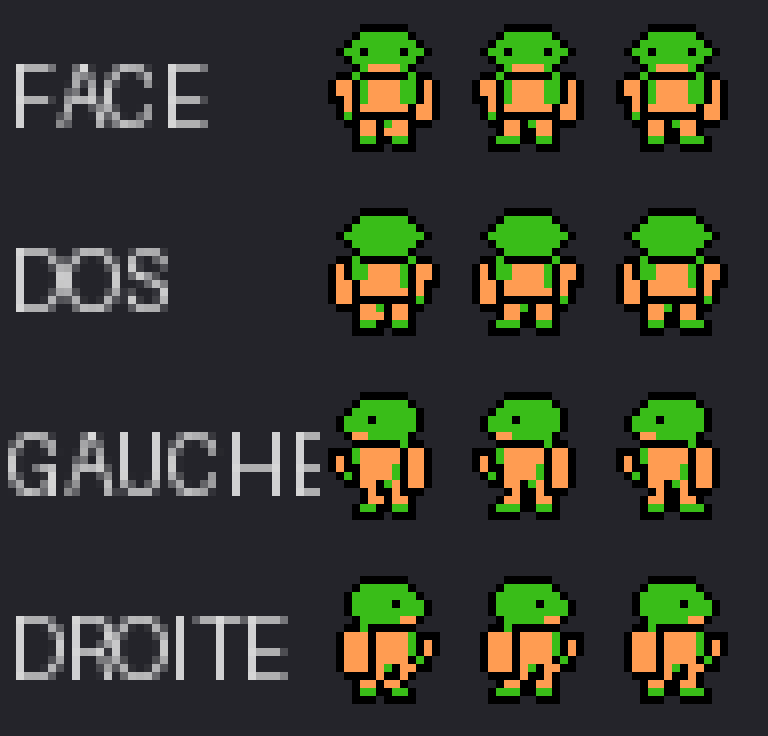
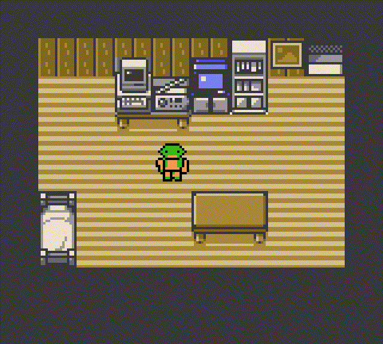
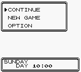
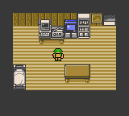
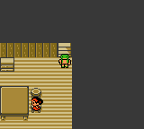

# Peon intégré dans la ROM

Ces images viennent du premier sprite réellement intégré et de son exécution dans PyBoy. Les décors sont encore ceux de Pokémon Crystal : aucune map Warcraft n'a été créée.

## Sprite technique, palette du jeu

Repos, pas A et pas B ; lignes face, dos, gauche et droite. Chaque image mesure réellement 16 × 16 pixels avant agrandissement.

## Capture réelle agrandie

[Capture native 160 × 144](peon_bedroom.png)

## Marche dans le jeu

L'animation montre quatre courts essais indépendants au D-pad, chacun repartant du même point. Elle ne correspond pas à un trajet continu et n'utilise pas les facings forcés du test de rendu.

## Sauvegarde et transition

[Résultats de validation](validation_results.json) · [Description technique et limites](../../../docs/PEON_SPRITE.md)

La ROM compile et les tests listés passent en émulateur. Portraits, icônes de menus, vélo, surf, pêche, écran titre et musique restent à adapter. La compatibilité sur la cartouche Chromatic n'a pas été vérifiée matériellement.
