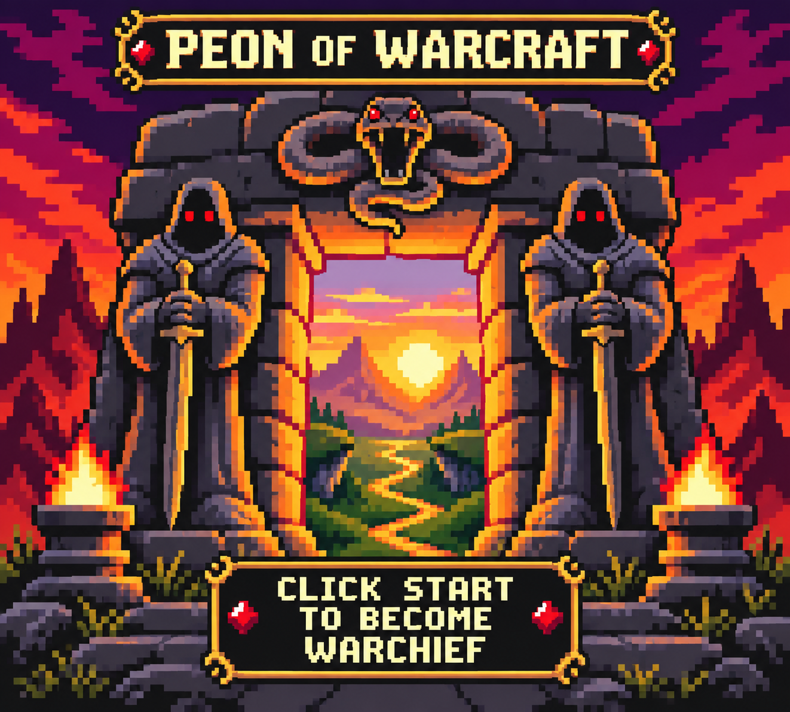

# Écran titre — portail redessiné, proposition v2

Cette proposition reprend les statues, le crâne cornu, les braseros, le coucher
de soleil et la route de la référence fournie. Le cadrage suit le rapport 10:9
de l'écran Game Boy ; le titre et le message Start sont ajoutés à la composition.

Il s'agit d'une maquette artistique agrandie, pas d'un fichier natif 160×144 ni
d'un écran déjà intégré à la ROM. La grille de pixels, les palettes par tuile et
la lisibilité à résolution native doivent encore être travaillées et vérifiées.
La ROM v0.1 existante n'a pas été modifiée pour cette proposition.

Fichier : `references/generated/title_portal_redrawn_v2.png`.
