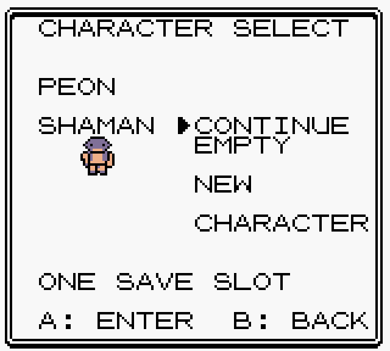
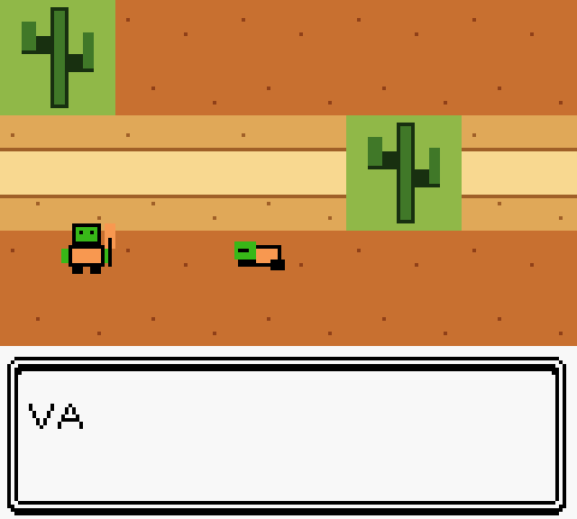
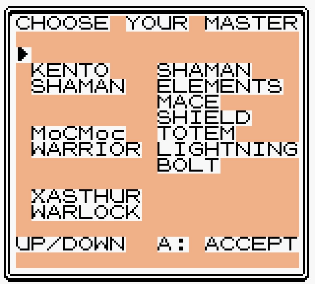
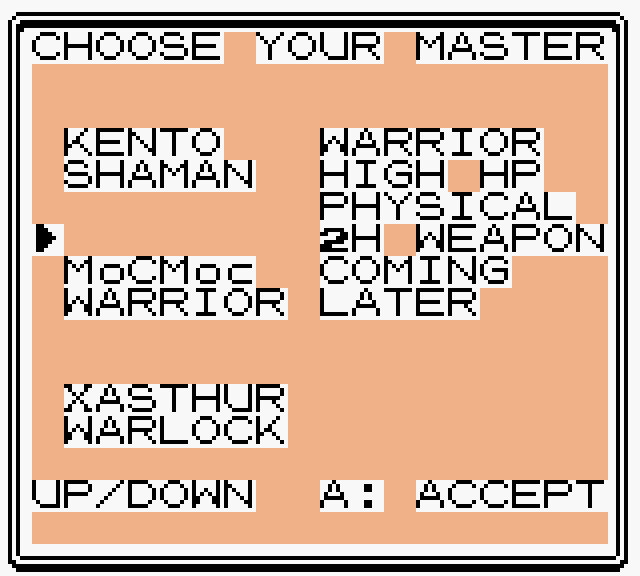
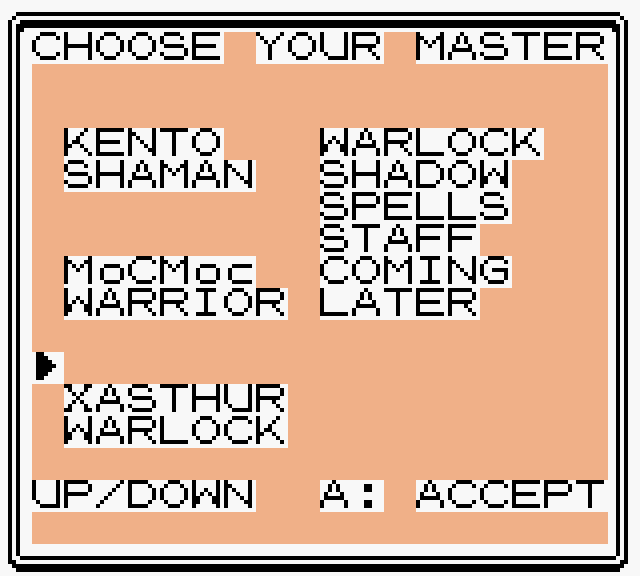
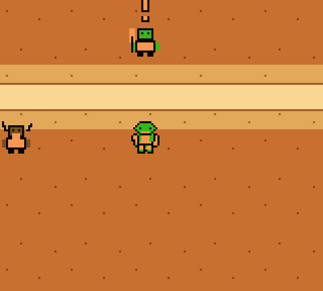
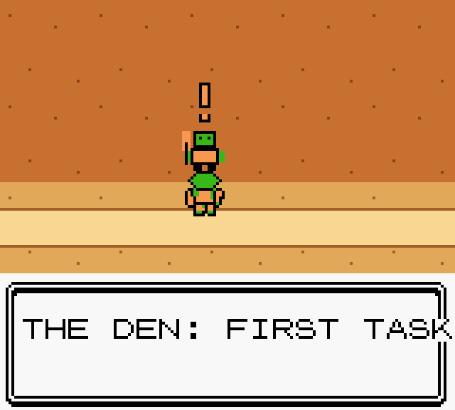
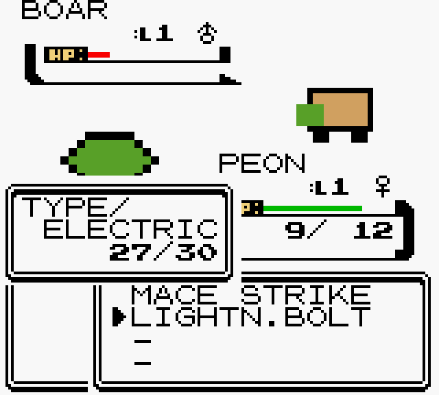
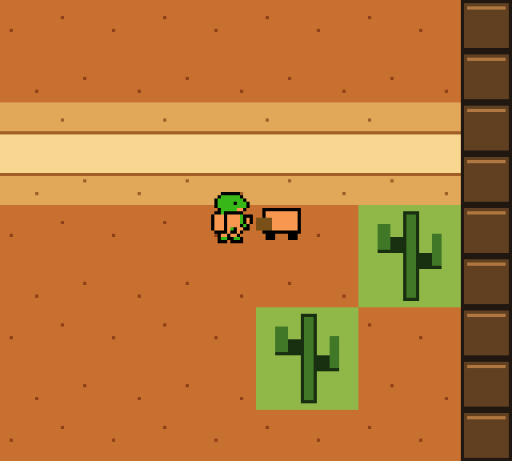

# Peon of Warcraft v0.1.1 — actual ROM captures

[Download playable ZIP](https://github.com/GASPARDWALT/peon-of-warcraft/raw/refs/heads/main/releases/v0.1.1/peon_of_warcraft_v0_1_1.zip)
· [Controls, walkthrough and limits](../../../docs/V0_1_PLAYABLE.md)

These are actual emulator captures from the playable ROM, not concept mockups.

## Title and one-slot character select

## Opening and class choice

## The Den and first quest

[Validation results](validation_results.json)
